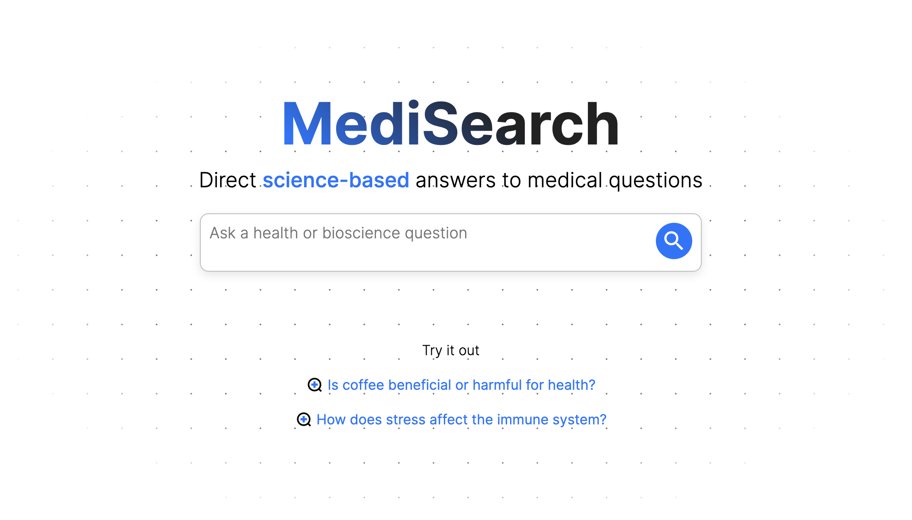

# Aviamedia frontend take-home test part 2

## Description

In this frontend coding test, you will implement an animation within the Aviamedia frontend.

## Specification

We created a NextJS application you can find in this repo. As a first step, please run `npm install && npm run dev` on localhost. The application should look something like:

The goal of the project is to animate the "Try it out" links. The output should look something like the videos in the files `moving_links_desktop_demo.mov` and `moving_links_mobile.MP4`.

Some requirements are:

1. Animation:

- The "Try it out" links should be animated to be horizontally scrolling from right to left.
- The animation should work with any finite number of "Try it out" links.
- The animation should be circular. That is, once a link scrolls out of view of the left side, it should reappear on the right side at some point.
- The animation should be smooth, continuous, and without lags.

2. Scroll (only for mobile):

- The animation should interact naturally with the user's scroll.
- When the user presses on the try it out links, the animation should stop and the user should be able to scroll the "Try it out" links horizontally.
- When the user stops scrolling, the animation should resume.
- The user should be able to click on the "Try it out" links and be redirected to the corresponding page.
- You are only required to implement this scrolling feature for mobile. However, make sure that the animation works and the UX is natural on desktop too.

To get a feel for how this should work, please download the Perplexity app ([Android](https://play.google.com/store/apps/details?id=ai.perplexity.app.android&hl=en&gl=US), [iOS](https://apps.apple.com/us/app/perplexity-ask-anything/id1668000334)) and scroll the links on the home page. Please also make sure that your solution works on popular mobile browsers such as Chrome or Safari.

## Submission instructions

Please submit these two tests within 24 hours.